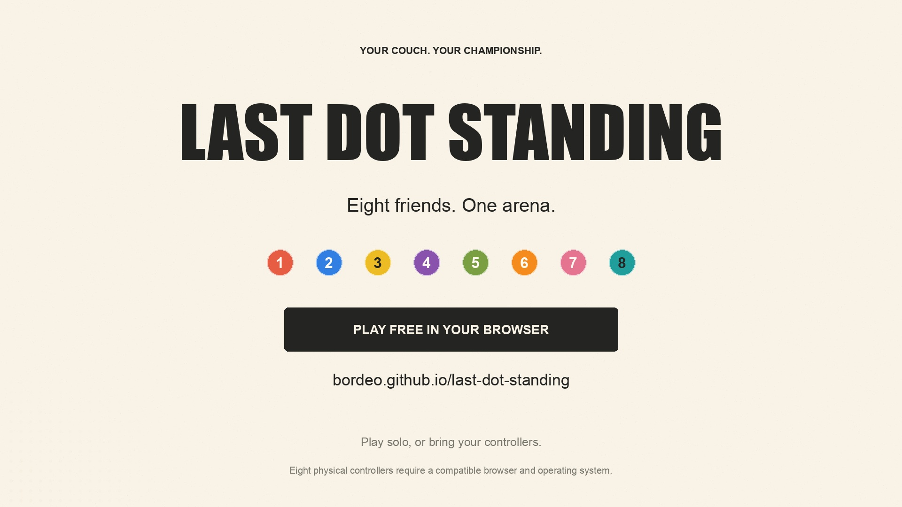

# Last Dot Standing

A local browser party game for up to eight people. Plain HTML, CSS and Canvas. No package installation, accounts, backend, analytics, or external assets.

**[Play in your browser](https://bordeo.github.io/last-dot-standing/)**

Play solo with your keyboard, or connect controllers for local multiplayer. Eight physical controllers require a browser version and operating system that support them. All players share one computer and screen.

## Watch the trailer

[](https://bordeo.github.io/last-dot-standing/media/trailer.mp4)

**[Watch the 30-second trailer](https://bordeo.github.io/last-dot-standing/media/trailer.mp4)** — 1080p, original music, and game-engine footage with computer-controlled players.

## Run locally

From this folder:

```sh
python3 -m http.server 8088 --bind 127.0.0.1
```

Open <http://localhost:8088>. Use HTTP localhost rather than opening `index.html` as a file: the game uses JavaScript modules and the Gamepad API needs a secure context.

- **Play solo:** one keyboard player (WASD or arrow keys) and seven computer players.
- **Local multiplayer:** press a button on each connected controller to join. Start a round with two or more players, using the on-screen button or a joined controller's Start button. Add up to two keyboard players under How to play.
- **Move:** left stick or D-pad. Hold a direction to build speed; faster direct hits push opponents farther. Release to brake, or steer against your momentum to turn. Push opponents over the solid boundary. It shrinks for 30 seconds; the last dot inside wins. Survivors at the time limit share a win. Scores persist across rounds, until you go Back to the opening screen.
- **Free play:** no elimination, shrink, or time limit. Can start with one player. Changing the mode during play begins a fresh round.
- **Pause:** Space, the on-screen button, or controller Start. R starts the next round after a result. Hiding the tab pauses; controller disconnection pauses until reconnection or leaving the round.
- **Sound/full screen:** optional controls at the top of the page. Sound starts off.

## Eight-controller checks

The game does not bypass browser or operating-system limits. A browser build that exposes eight physical gamepads is needed to test eight physical devices. A CPU player is explicitly labelled CPU and is never included in the physical-controller count.

1. Choose Local multiplayer. Connect each controller and press a button to expose it to the page and claim a player slot.
2. Check that all eight slots show PAD rather than CPU. The status line should report eight physical controllers visible to the browser.
3. Enable Free play and start. Move each stick independently; its numbered dot and the small indicator on its card must move. Press buttons and check that only that card lights up.
4. Move all eight at once. Connect a ninth controller: it must not claim an arena slot or control an existing player.
5. Disconnect one controller: the game pauses and identifies that player. Reconnect, then resume. If the browser assigns a different device index, leave the round and use Back to create a fresh group.
6. Disable Free play for normal knockout rounds.

Standard-mapped controllers are expected for D-pad and Start controls; the first two axes drive movement on other mappings. Device labels come from the browser. Browser index numbers are retained independently of player slot numbers.

## Engine checks

```sh
node --test engine.test.mjs
```

These checks exercise eight simultaneous inputs, sparse controller indices, a ninth controller, movement normalization, collision response, eliminations, free-play boundaries and round completion. Physical controllers still need a hands-on test.

## Publish updates

Push changes to `main`. The GitHub Actions workflow checks the JavaScript and runs the engine tests, then publishes the game assets and trailer to GitHub Pages. Failed tests prevent deployment. You can also start it manually from the Actions tab.

The game runs under a repository subpath and uses relative asset URLs. It does not require a Chromium checkout or build to run.
